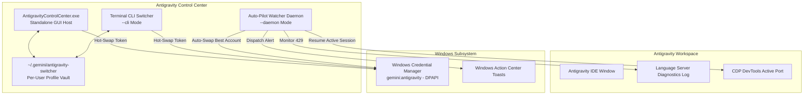

<div align="center">

  

  # Antigravity Control Center

  **Autonomous Multi-Account Orchestrator, Quota Radar & Overnight Task Continuity**

  [](https://github.com/demusraph/antigravity-control-center/releases)
  [](CHANGELOG.md)
  [-0078D6?style=flat-square&logo=windows&logoColor=white)](https://microsoft.com)
  [](#-roadmap)
  [](pyproject.toml)
  [](SECURITY.md)
  [](LICENSE)

  <br>

  

</div>

<br>

## ⚡ Overview

**Antigravity Control Center** is an enterprise-grade desktop management system designed to eliminate quota exhaustion barriers (`RESOURCE_EXHAUSTED` / HTTP 429) across Gemini and Claude AI models.

Rather than forcing developers to manually log out, restart applications, or interrupt long-running coding tasks, Antigravity Control Center provides instantaneous **hot-swapping via Windows Credential Manager**, live **multi-account quota radar telemetry**, and an **autonomous overnight auto-pilot** that intercepts rate limits and resumes unfinished AI tasks via Chrome DevTools Protocol (CDP).

---

## ✨ Key Capabilities

### 🔄 Zero-Loss Credential Hot-Swapping
- Swaps active authentication tokens directly inside the Windows Credential Manager (`gemini:antigravity`) via native Win32 DPAPI (`advapi32.dll`).
- **Preserves Editor State**: Open tabs, SQLite caches (`state.vscdb`), prompt histories, and terminal workspaces remain completely undisturbed during switches.

### 🤖 Autonomous Overnight Auto-Pilot (CDP Integration)
- A decoupled, low-overhead background daemon that monitors language server diagnostics in real time.
- **Self-Healing Execution Cycle**:
  1. Detects `RESOURCE_EXHAUSTED` (429) exceptions in `language_server.log`.
  2. Evaluates the multi-account pool and selects the account with the highest available quota.
  3. Hot-swaps the active OS credentials in milliseconds.
  4. Interfaces with the local **Chrome DevTools Protocol (CDP)** endpoint to automatically trigger task resumption—enabling autonomous, uninterrupted overnight agent runs while you sleep.
  5. Emits unobtrusive native Windows toast notifications upon state transitions.
- **Hardened Lifecycle & Stale PID Auto-Cleanup**: Dynamic runner auto-discovery (`main.py --daemon` / `daemon.py` / `-m antigravity_switcher.daemon`), real-time Win32 `GetExitCodeProcess == 259 (STILL_ACTIVE)` verification, non-console stream redirection to `os.devnull` under `pythonw.exe`, and automated PID lock removal.

### 📊 Real-Time Multi-Account Quota Radar
- Live telemetry calculation querying official OAuth endpoints for:
  - **Gemini Models** (5-Hour Sliding Window & Weekly Token Limit)
  - **Claude & GPT Models** (5-Hour Window & Weekly Quota)
  - **Dynamic Reset Deltas** (e.g., `3h 48m`, `5d 12h`)
- Algorithmic score ranking that automatically flags the optimal backup account with a `Recommended` badge and enables a 1-click quick-switch action.

### 🌲 Live Subagent DAG & Execution Trace
- Real-time hierarchical visualization of active conversation threads: Parent Orchestrator $\rightarrow$ Child Subagents.
- Tailing telemetry on `transcript.jsonl`: Step counter, live tool execution chips (`tool_calls`), and estimated token burn rates.
- Deadlock / Unresponsive detection: Flags agents that stall for $>60$ seconds with quick-access session switching across recent conversation IDs.

### 🔌 MCP Server Matrix & Health Supervisor
- Auto-discovers all Model Context Protocol (MCP) servers configured in `~/.gemini/config/mcp_config.json`.
- Real-time Windows process inspection via `psutil`: PID, RAM RSS (MB), CPU%, and uptime.
- **1-Click Ping Probe**: Tests stdio JSON-RPC handshake responsiveness (`initialize` probe) with exact latency measurement in milliseconds.
- **1-Click Server Restart**: Kills zombie processes and resets stdio pipelines to clean standby.

### 🪟 Native Window Physics & React Bits Micro-Interactions (v1.2.0)
- **PyQt5 Window Physics Easing**: Eliminates abrupt jumping on Windows 11 frameless windows using `QPropertyAnimation`:
  - **Maximize / Restore**: 220ms `QEasingCurve.OutCubic` geometry interpolation honoring the Windows Taskbar.
  - **Minimize**: 140ms `QEasingCurve.InQuad` opacity fade before minimization.
  - **Tray Restore**: 160ms `QEasingCurve.OutQuad` fade-in upon activation.
  - **Morphing Window Controls**: Smooth SVG rotation and scale animation on maximize/restore toggling.
- **Curated React Bits Matrix**:
  - `SpotlightCard`: Dynamic mouse-tracking radial glow following your cursor across obsidian surfaces.
  - `DecryptedText`: Cyber scramble decoding effect upon switching accounts.
  - `CountUp`: Smooth number counting for quota percentages.
  - `ButtonSpring`: Tactile spring bounce (`cubic-bezier(0.34, 1.56, 0.64, 1)`) on interactive controls.
  - `TabAnimatedEnter`: Vertical slide and fade-in transitions across views.

### 📐 Responsive Mission Control Toolbar & Ergonomic Sizing (v1.2.2)
- **Anti-Wrapping Layout Hardening**: Strict `whitespace-nowrap` and `shrink-0` architecture across all status badges, recommendation actions, Auto-Pilot toggle buttons, and navigation tabs—permanently eliminating awkward multi-line text wrapping on narrow viewports.
- **Dynamic Active Email Truncation**: Responsive CSS ellipsis truncation (`truncate max-w-[170px] sm:max-w-[260px] md:max-w-[340px]`) with interactive hover tooltip displaying full identity.
- **High-DPI Desktop Geometry**: Default proportions expanded to **`840 x 800`** (minimum `660 x 680`) with fine-tuned Win32 `HTCAPTION` hit-testing for seamless dragging and Aero Snap under 125%-150% Windows display scaling.
- **System Tray Integration**: Silent background minimization (`Hide to Tray`) with global taskbar tray restore.

---

## 🏗️ Technical Architecture



---

## 🚀 Quick Start

### Option 1: Standalone Executable (No Python Required)
1. Download **`AntigravityControlCenter-Windows-x64.zip`** from [Latest Releases](https://github.com/demusraph/antigravity-control-center/releases).
2. Extract the ZIP archive anywhere on your system.
3. Run **`AntigravityControlCenter.exe`**.

> [!NOTE]
> #### 🛡️ Windows SmartScreen Notice
> Because Antigravity Control Center is a newly released, independent open-source project without a commercial Microsoft EV Code Signing Certificate ($500+/year), Windows Defender SmartScreen may display an alert:
> 
> **"Windows protected your PC / Unknown Publisher"**
> 
> 1. Click **More info** (*Informasi selengkapnya*).
> 2. Click **Run anyway** (*Tetap jalankan*).
> 
> All source code and build pipelines are 100% transparent, auditable, and compiled publicly via GitHub Actions.

### Option 2: Run from Source (Python 3.10+)
```bash
# 1. Clone the repository
git clone https://github.com/demusraph/antigravity-control-center.git
cd antigravity-control-center

# 2. Install dependencies
pip install -r requirements.txt

# 3. Launch Desktop GUI
python main.py
# or via batch launcher:
scripts\Launch-GUI.bat

# 4. Launch Interactive CLI
python main.py --cli
# or via batch launcher:
scripts\Launch-CLI.bat
```

### Option 3: Install Desktop Shortcut
Run **`scripts\Create-Desktop-Shortcut.bat`** to instantly create a shortcut with the official Obsidian iridescent icon on your Windows Desktop.

---

## 🔒 Security & Privacy Guarantees

1. **Native DPAPI Encryption**:
   - Accounts are stored locally on your machine using Windows Data Protection API (DPAPI).
   - Sensitive tokens are **never** written in plain text to disk or synced to third-party servers.
2. **Zero Cloud Telemetry**:
   - 100% offline-capable and localhost-bound (`127.0.0.1`).
   - No external trackers, analytics, or telemetry beacons.
3. **Transparent & Auditable**:
   - Fully open-source codebase with minimal dependencies. See [`SECURITY.md`](SECURITY.md) and [`docs/SECURITY_MODEL.md`](docs/SECURITY_MODEL.md) for full architecture details.

---

## 📁 Repository Structure

```text
antigravity-control-center/
├── .github/
│   ├── ISSUE_TEMPLATE/
│   │   ├── bug_report.yml          # Structured GitHub Issue Form for bug triage
│   │   └── feature_request.yml     # Structured Feature Request template
│   ├── workflows/
│   │   └── build-exe.yml           # Automated Windows CI/CD Release pipeline
│   └── PULL_REQUEST_TEMPLATE.md    # Pull Request checklist & guidelines
├── assets/
│   ├── icons/
│   │   ├── app_icon.ico            # Multi-resolution Windows executable icon
│   │   └── app_icon.png            # High-res Obsidian branding logo
│   └── screenshots/
│       └── showcase.png            # Clean UI preview screenshot
├── docs/
│   └── SECURITY_MODEL.md           # Local DPAPI & credential security details
├── scripts/
│   ├── Create-Desktop-Shortcut.bat # 1-Click desktop shortcut installer
│   ├── Launch-CLI.bat              # Fast headless terminal launcher
│   └── Launch-GUI.bat              # Direct desktop GUI launcher
├── src/
│   └── antigravity_switcher/
│       ├── __init__.py             # Package metadata & exports
│       ├── __main__.py             # Package execution dispatcher
│       ├── app.py                  # PyQt5 Native Obsidian GUI & WebEngine radar
│       ├── daemon.py               # Auto-Pilot & CDP auto-resume daemon
│       ├── mcp_supervisor.py       # MCP matrix health supervisor & stdio self-heal
│       ├── subagent_tracker.py     # Live Subagent DAG tracer & session telemetry
│       └── switcher.py             # Win32 Credential Manager hot-swapper & CLI
├── main.py                         # Root execution entry point
├── pyproject.toml                  # Modern PEP 517/621 packaging configuration
├── requirements.txt                # Python dependencies (PyQt5, PyQtWebEngine)
├── .gitignore                      # Filter for caches, logs, and session profiles
├── CHANGELOG.md                    # Keep a Changelog semantic release notes
├── CONTRIBUTING.md                 # Contributor onboarding & development guide
├── LICENSE                         # MIT Open Source License
├── README.md                       # Master technical documentation
└── SECURITY.md                     # Responsible disclosure & privacy policy
```

---

## 🗺️ Roadmap

- [x] **v1.0.0**: Windows 10/11 x64 support, PyQt5 Obsidian GUI, Dual Quota Radar, CDP Auto-Resume, Standalone Executable, GitHub Actions CI/CD.
- [x] **v1.1.0**: Live Subagent DAG Tracker, MCP Health Matrix & 1-Click Self-Heal, Windows AppUserModelID taskbar binding.
- [x] **v1.2.0**: Native PyQt5 Window Physics Easing (`QPropertyAnimation`), React Bits Micro-Interactions, 1:1 Antigravity 2.0 Obsidian Dark Header.
- [x] **v1.2.1**: Auto-Pilot Daemon Lifecycle Hardening, Stale PID Auto-Cleanup, Non-Console Stream Guards, Clean 1:1 Typography.
- [x] **v1.2.2**: Responsive Single-Line Enforcement (`whitespace-nowrap`), Active Email Ellipsis Truncation, Ergonomic Desktop Geometry (`840x800`).
- [ ] **v1.3.0**: Cross-platform **macOS Keychain** integration (`/usr/bin/security`) & Apple Silicon M-series DMG bundle.
- [ ] **v1.4.0**: Linux Secret Service / Keyring integration.
- [ ] **v1.5.0**: Encrypted cross-device profile export/import.

---

## 🤝 Contributing

Contributions are welcome! Please read [`CONTRIBUTING.md`](CONTRIBUTING.md) before submitting a pull request.

---

## 📄 License

Distributed under the **MIT License**. See [`LICENSE`](LICENSE) for details.
